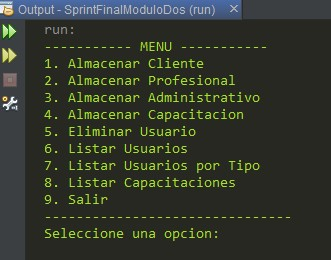

**_<h1 align="center">:vulcan_salute: Ejercicio Plataforma Sprint Final:computer:</h1>_**
**_<h2 align="center">Módulo 2 - Fundamentos de Programación en Java</h2>_**

- Ejercicio desarrollado por Katherine Alderete

- [Sprint Final](https://github.com/KathyAlde21/sprint_final_modulo_dos)
